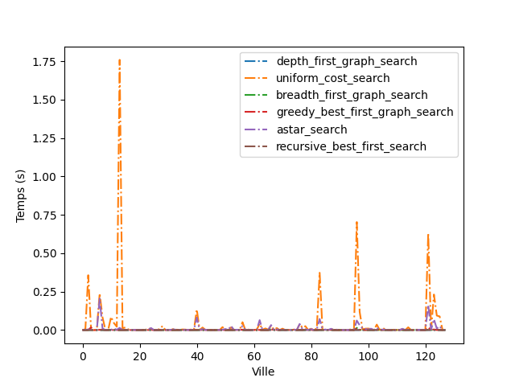
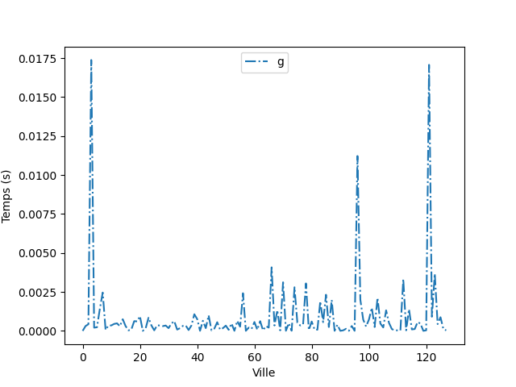
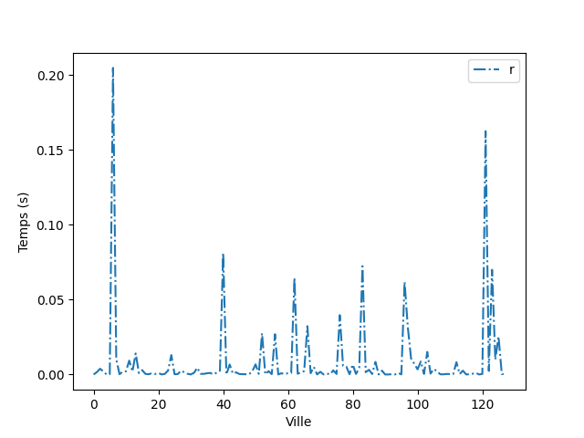
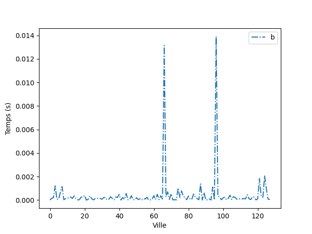
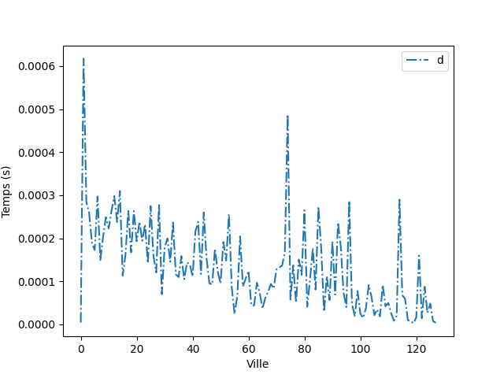
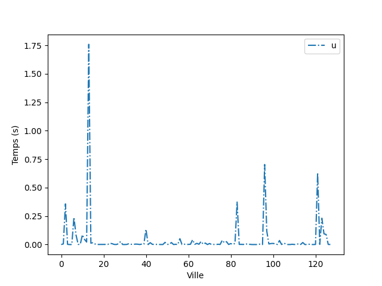

# Travail devoir maison 1

**Authors:** *Becue* *Louis* et *Pruvost* *Paul*

## Commandes

**Attention** : Cela prends un certains temps de generer tous les tests et les graphes.

Les graphes sont déja fait et convertit en fichiers png.

``` bash
python3 .\main.py
```

## Les différents algorithmes de recherches testés

### Algorithmes informés

* ``Greedy`` :  search.greedy_best_first_graph_search
* ``Astar`` : search.astar_search
* ``RBFS`` : search.recursive_best_first_search

### Algorithmes non informés

* ``Parcours en largeur`` : search.breadth_first_graph_search
* ``Parcours en profondeur`` : search.depth_first_graph_search
* ``Uniform cost`` : search.uniform_cost_search

## Résultats

### Comparaison 


On compare le temps d'éxecution de chaque algorithme ci-dessus en partant de la ville 0 jusqu'aux ville allant de 1 à 128.

### Algorithmes informés :

### Greedy



On remarque les temps moyen, maximum et minimium sont assez proche, ce qui signfie que l'algorithme est assez constant en temps ce qui est un point trés positives.
De plus on sait que cette algorithme n'est pas forcément optimal suivant le probléme et les données (exemple du rendu de monnaie).

* temps moyen = 0.0009157960936647669 seconds

* temps maximum = 0.016354999999748543 seconds

* temps minimum = 1.2000018614344299e-06 seconds

### Astar


Même remarque que pour le greedy, même si pour le astar le temps moyen est un peu plus faible et il arrive a être souvent trés faible en temps.

* temps moyen = 0.008824997656290634 seconds

* temps maximum = 0.2098420999973314 seconds

* temps minimum = 7.00001692166552e-07 seconds

### RBFS



Même remarque que les précédents.

* temps moyen = 8.168437486233415e-05 seconds

* temps maximum = 0.0005111999998916872 seconds

* temps minimum = 1.1999982234556228e-06 seconds

### Algorithmes non informés

### Parcours en largeur



On remarque ici que le temps est trés constant (seulement 2 pics) et un coût moyen trés bon.
Seulement ici le resulat ne sera pas forcément le resultat optimal, car dés qu'un résultat est trouvé celui-ci sera retourné.

* temps moyen = 0.0004617742186212581 seconds

* temps maximum = 0.017459999999118736 seconds

* temps minimum = 6.000009307172149e-07 seconds

### Parcours en profondeur

Même remarque que le parcour en largeur, car ce sont des algorithmes qui sont assez proche.



* temps moyen = 0.00013338749991476107 seconds

* temps maximum = 0.0005662000003212597 seconds

* temps minimum = 2.1999985619913787e-06 seconds

### Uniform cost



On remarque que par apport aux autres il est beaucoup plus lent et posséde un pics immense et la pire moyenne.
On notera que le resulat est optimal.

* temps moyen = 0.04293857265616907 seconds

* temps maximum = 1.744717599998694 seconds

* temps minimum = 1.0000003385357559e-06 seconds

## Conclusion:

* ``valeur minimum``
* **valeur** **maximum**

|               | Greedy | Astar | RBFS | Parcours en largeur  | Parcours en profondeur  | Uniform cost  |
|---            |  ---   |  ---  |  --- |        ---           |          ---            |     ---       |
| temps moyen   | 0.0009157960936647669   | 0.008824997656290634| ``8.168437486233415e-05`` | 0.0004617742186212581 | 0.00013338749991476107 |  **0.04293857265616907**   |
| temps maximum | 0.0005111999998916872  | 0.2098420999973314 | 0.0005111999998916872| 0.017459999999118736 | ``0.0005662000003212597`` |  **1.744717599998694**   |
| temps minimum | 1.2000018614344299e-06 | 7.00001692166552e-07 | 1.1999982234556228e-06| ``6.000009307172149e-07`` | **2.1999985619913787e-06** |  1.0000003385357559e-06   |

L'algorithme RBFS est meilleur que les autres algorithmes. Son temps moyen et maximum sont inférieurs aux autres, mais son temps minimum est legerement superieur à Astar et parcours en largeur.

Le pire algorithme est sans appel l'uniform cost. On le voit tout de suite grâce au premier graphe.

On remarque peu de différence entre les algorithmes informés et non informés dans nos tests. 
Mais on peut dire que les algorithmes non informés peuvent être trés bon comme ne pas l'être du tout.
Alors que les algorithmes informé sont plus constant dans leurs perfommances et dans leurs résulats, ce qui peut être intéressant pour maintenir les perfommances.
